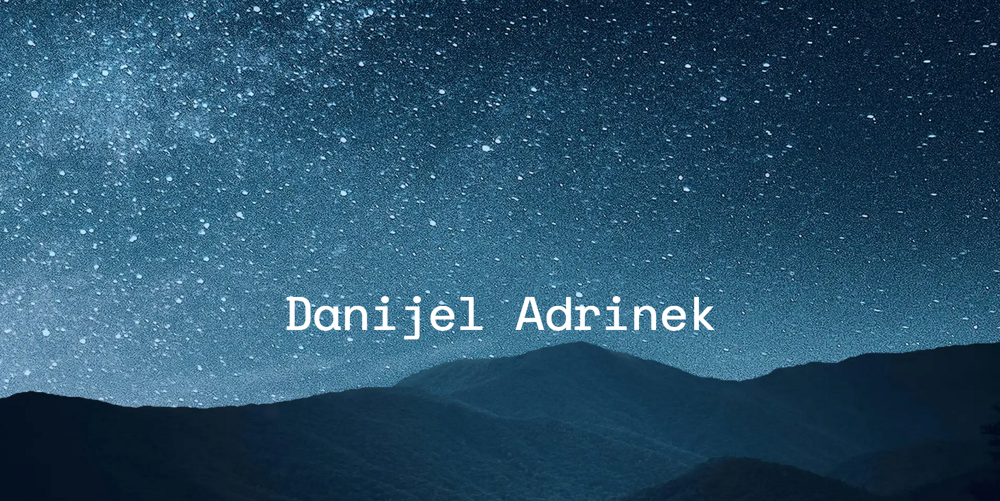

# 🚀 NextJS Portfolio
This portfolio was made for me to be able to showcase my experience using the NextJS framework, it was launched using vercel on this url:

[portfolio-flax-tau-90.vercel.app](portfolio-flax-tau-90.vercel.app)



# ⚡ About
I created this app because unfortunately I am not allowed to showcase any of the projects I did for any of the companies I worked for, which makes it harder to find a new job, I have experience, I have the knowledge, and I wanted to be able to show it right here in my own project.

I will point out that I am not a designer, never have been, and most likely never will be.

# 🛑 Built on
* NextJS 14.2.3
* React 18.3.1
* React-spring/parallax 9.7.3
* aos 3.0.0-beta.6
* prismjs 1.29.0
* sharp 0.33.3
* zod 3.23.8

# 💻 Development
1. clone the repository
```
$ git clone https://github.com/DanijelAdrinek/portfolio.git
```

2. install dependencies
```
$ npm install
```

3. run app
```
$ npm run dev
```